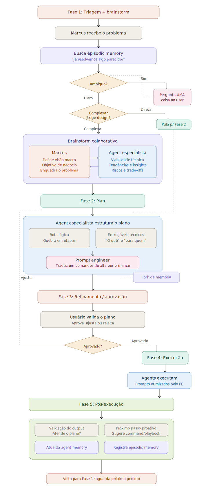

# Gemini CLI Agent Ecosystem v10

**Versão:** v10.0.0 · **Sinergia:** 10/10

**37 agentes especializados** · **31 slash commands** · **28 skills passivas** · **12 playbooks operacionais**

Um ecossistema completo para desenvolvimento backend Java/Spring Boot, QA, DevOps/SRE, Data, e migração de monólitos — tudo orquestrado pelo **Agent-Marcus** no terminal do Gemini.

```
┌─────────────────────────────────────────────────────────────┐
│                     Agent-Marcus (global)                     │
│       Orquestrador · Gemini CLI Expert · PT-BR · 🚀          │
├──────────┬──────────┬───────────┬────────┬──────────────────┤
│ Dev (6)  │ QA (8)   │ DevOps(11)│Data (3)│ Migration (7)    │
│ 6 cmds   │ 8 cmds   │ 11 cmds   │ 2 cmds │ 4 cmds          │
│          Utility: prompt-engineer (1 agent, 1 cmd)           │
└──────────┴──────────┴───────────┴────────┴──────────────────┘
```

---

**Documentação complementar (Anexos):**

| Anexo | Conteúdo | Quando consultar |
|-------|---------|-----------------|
| [ANEXO I — Manual de Casos de Uso](ANEXOI-MANUAL-CASOS-DE-USO.md) | 70+ cenários do dia a dia com comandos exatos | "Como faço X?" |
| [ANEXO II — Arquitetura](ANEXOII-ARQUITETURA.md) | Context isolation, tokens, memória, tools, otimização | "Como funciona por baixo?" |
| [ANEXO III — AI-OS Brutal Edition](ANEXOIII-AI-OS-Brutal-Edition.md) | Referência operacional direta, sem teoria | "Me dá o comando, sem enrolação" |
| [ANEXO IV — Agent Capabilities](ANEXOIV-AGENT-CAPABILITIES.md) | Capacidades detalhadas dos 37 agents (Marcus consulta para routing) | "O que o backend-dev sabe fazer?" |

---

## Workflow do Marcus — 5 Fases



O Marcus opera em 5 fases para toda demanda:

| Fase | O que acontece |
|------|---------------|
| **1. Triagem + Brainstorm** | Recebe problema → busca episodic memory → resolve ambiguidade → brainstorm colaborativo se complexo |
| **2. Plan** | Agent especialista estrutura rota lógica + entregáveis → prompt-engineer traduz em comandos |
| **3. Aprovação** | Usuário valida o plano → aprova, ajusta ou rejeita |
| **4. Execução** | Agents executam com prompts otimizados |
| **5. Pós-execução** | Validação contra plano → sugestão proativa de próximo passo |

---

## Instalação

### Pré-requisitos

- Gemini CLI instalado
- Acesso ao Google Gemini

### Instalar o ecossistema

```bash
# 1. Executar o instalador (faz backup automático do ~/.gemini existente)
chmod +x install.sh
./install.sh

# 2. Pronto!
gemini --agent marcus
```

### Verificar instalação

```bash
# Agents instalados
ls ~/.gemini/agents/*.md | wc -l

# Commands disponíveis
ls ~/.gemini/commands/*.md | wc -l

# Skills instaladas
find ~/.gemini/skills -name "CLAUDE.md" | wc -l
# Nota: Skills podem usar CLAUDE.md ou GEMINI.md
```

---

## Como Funciona

Você sempre começa com Marcus. Ele é seu ponto de entrada para tudo.

```bash
gemini --agent marcus
```

Marcus faz uma varredura do projeto e fica pronto para rotear qualquer pedido.

### O Fluxo

```
Você descreve o problema
    ↓
Marcus classifica e roteia
    ↓
┌─────────────────────────────┐
│ Slash command (orquestra     │ ← para tarefas multi-step
│ múltiplos agents)            │
└──────────┬──────────────────┘
           │
┌──────────▼──────────────────┐
│ Agent especialista           │ ← executa com context isolado
│ (enriched por skill passiva) │
└─────────────────────────────┘
```

---

*Para mais detalhes, consulte `GEMINI.md` no diretório raiz.*
